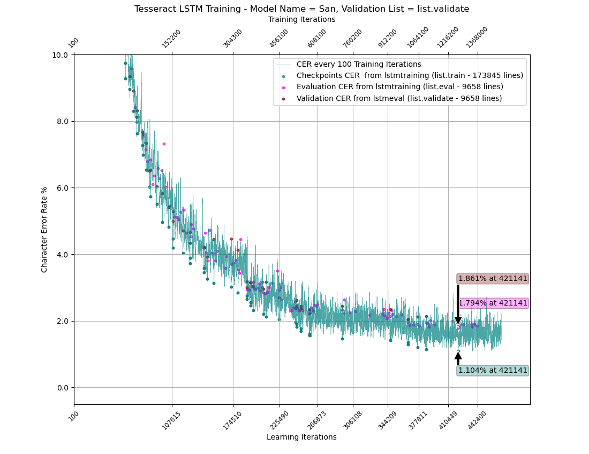

# tesstrain-Sanskrit-IAST
Tesseract Traineddata for Sanskrit in Devanagari script and IAST (written in English alphabet with diacritics)

## Traineddata files - Fast Integer Models (Model_CER%_LearningIteration_Training)iteration)

- [20201017 - Replace Layer on Power8](tessdata_fast/Sanskrit-1017.traineddata)
- [20201211 - Plus Minus on Power8 - Sanskrit_0.141_286442_2117300](tessdata_fast/Sanskrit_0.141_286442_2117300.traineddata)
- [20201211 - From Scratch on AArch64 - San_1.15_386224_1103200](tessdata_fast/San_1.15_386224_1103200.traineddata)
- [20201212 - From Scratch on AArch64 - San_1.104_421141_1266900](tessdata_fast/San_1.104_421141_1266900.traineddata)

## Plotting of Character Error Rates

MatPlotLib can be used to visualize the CER from training iterations, checkpoints, evaluation test and validation test. 

### 20201211 - Plus Minus on Power8 - scanned list included in training

### 20201211 - From Scratch - Validate list not included in training

